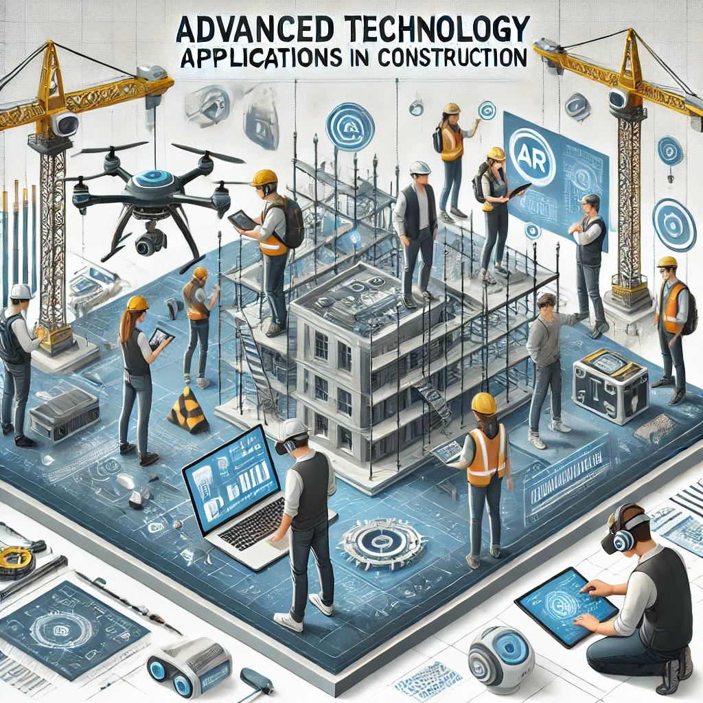

# CMGT 40095/50095: Advanced-Tech-Applications-in-Construction

**Instructor**: Ruoxin Xiong, Ph.D., Assistant Professor, Construction Management, College of Architecture and Environmental Design, Kent State University

  

Welcome to the **CMGT 40095/50095: Advanced Technology Applications in Construction** repository! This guide provides essential information on how to navigate the repository, explore student project displays, and understand copyright information.

## 📖 Overview
This repository contains course materials, including interactive Jupyter Notebooks, code snippets, and project documentation, designed to introduce and explore advanced technologies in construction.

- Hands-on Jupyter Notebooks for practical learning.
- Sample datasets for construction-related analysis.
- Student project showcases and case studies.
- Guidelines for running and modifying the code.

## 🗺️ Navigation
To help you locate and utilize resources efficiently, the repository is structured as follows:

- **[`lectures/`](./lectures)** – Contains all interactive Jupyter Notebooks.
- **[`datasets/`](./datasets)** – Sample datasets used in the notebooks.
- **[`projects/`](./projects)** – Student project documentation and files.
- **[`docs/`](./docs)** – Additional guides and references. For a detailed guide on how to use the materials, please refer to [docs/guidelines.md](docs/guideline.md).

## 🎓 Hands-on Projects
This repository highlights Hands-on student projects demonstrating the application of advanced construction technologies. Below are some examples:

- [Data Visualization in Construction](https://github.com/ruoxinx/CMGT-40095-50095/tree/main/lectures/L02_construction_data_visualization)
- [Data Sensing Projects Using the Raspberry Pi for Built Environment Monitoring](https://github.com/ruoxinx/CMGT-40095-50095/tree/main/lectures/L05_construction_data_sensing)
- [Data Preprocessing & Basic Descriptive Analysis in Construction](https://github.com/ruoxinx/CMGT-40095-50095/tree/main/lectures/L06_construction_data_process)
- [Machine Learning Models in Construction](https://github.com/ruoxinx/CMGT-40095-50095/tree/main/lectures/L07_ML_construction) (using concrete compressive strength and building permits data)
- [Deep Learning Models in Construction](https://github.com/ruoxinx/CMGT-40095-50095/tree/main/lectures/L08_DL_Construction) (safety equipment and construction vehicle detection)

### 📌 Featured Projects:

#### Evaluating Indoor Thermal Comfort in the CAED Building (Spring 2025)
- **Romby’s Group**: Luke Chamberlain, Harris Cheifetz, Ethan Clow, Icarus Fernandes, Sarah Joseph, Katelyn Owens, Aaron Rombach – [Project Report](projects/2025%20Spring/Project%20Report%20(Assignment%233).pdf)
- **Group 2**: Shiva Kumar Miryala, Javeed Shaik, Gnana Jagadeesh Gangula, Ozaswi Acharya, Shivani Patel, Bishnu Adhikari, Neha Pillanagrovi, Mehraneh Aladini, Reshma Ananthaneni – [Project Report](projects/2025%20Spring/Assignment%20%233%20Group%20REPORT.pdf)

## 📜 Copyright & License

© 2025 Ruoxin Xiong. All rights reserved.

For inquiries about reuse, adaptations, or collaborations, please open an issue or submit a request or contact me (rxiong3@kent.edu).

**Enjoy exploring and contributing to the field of construction technology!**
