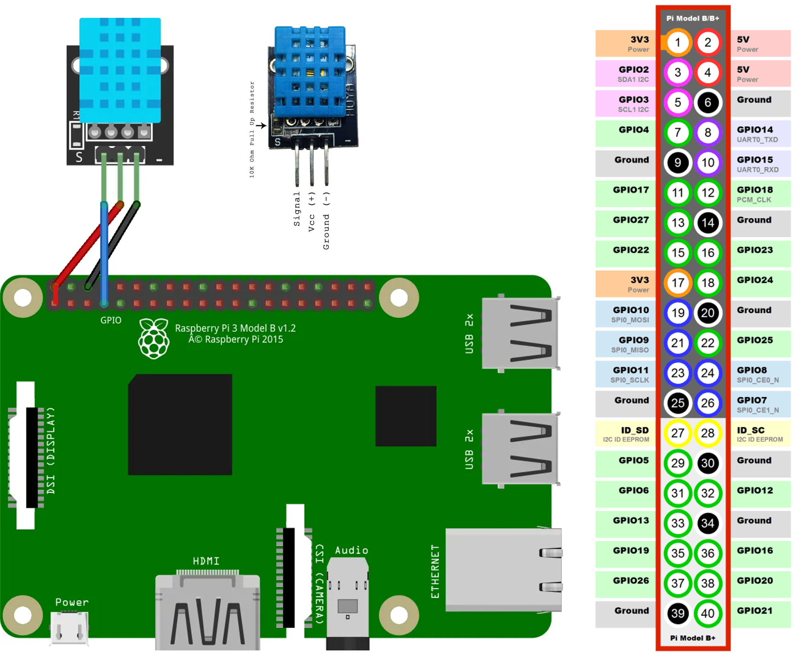

# Raspberry Pi Temperature and Humidity Monitoring for Themral Comfort Evaluation

This project demonstrates how to read temperature and humidity data from a DHT11 sensor using a Raspberry Pi. The collected data is then displayed in the terminal or can be logged for further analysis.

## Table of Contents
1. [Introduction](#introduction)
2. [Hardware Requirements](#hardware-requirements)
3. [Wiring the Sensor](#wiring-the-sensor)
4. [Setting Up Raspberry Pi](#setting-up-raspberry-pi)
5. [Installing Required Python Libraries](#installing-required-python-libraries)
7. [Project Code](#project-code)
8. [Running the Script](#running-the-script)

---

## Introduction
DHT sensors (DHT11 or DHT22) are popular for measuring **temperature** and **humidity**. This project guides you through connecting one of these sensors to a Raspberry Pi, reading the data in Python, and printing the values to the terminal.

---

## Hardware Requirements
- **Raspberry Pi** (any model with GPIO pins; Pi 3, Pi 4, or Pi Zero, etc.)
- **DHT11 or DHT22 sensor** (three-pin output type)
- **Resistor**: 10kΩ (pull-up resistor, if needed)
- **Breadboard** and **jumper wires** (for prototyping)
- **Power Supply** for Raspberry Pi (5V, 2-3A recommended)

---

## Wiring the Sensor
Below is the typical wiring for a **DHT22** or **DHT11**. Be sure to consult your sensor’s pinout.

| **DHT Pin** | **Raspberry Pi Pin** | Notes                                               |
|-------------|----------------------|-----------------------------------------------------|
| VCC         | 3.3V (Pin 1 or 17)  | Power pin (3.3V)                                    |
| DATA        | GPIO 4 (BCM 4)*     | Data pin (can use any free GPIO, example uses GPIO 4) |
| GND         | Ground (Pin 6, 9, etc.) | Shared ground                                      |

*You can choose a different GPIO if you prefer, but ensure your code reflects that change.



**Pull-up Resistor**  
A 10kΩ resistor is typically connected between the DATA and VCC pins (3.3V) to stabilize signals.

> **Important:**  
> The Raspberry Pi uses **3.3V logic**. Applying 5V to GPIO pins can damage the Pi.

---

## Setting Up Raspberry Pi
1. **Prepare microSD Card**  
   - Install Raspberry Pi OS on an SD card (Raspberry Pi OS Lite or Desktop).
2. **Boot the Raspberry Pi**  
   - Connect keyboard, mouse, monitor (or use SSH for headless setup).
3. **Network Configuration**  
   - Configure Wi-Fi or Ethernet and make sure your Pi has internet access.

4. **System Updates**  
   ```
   sudo apt-get update
   sudo apt-get upgrade
   ```

##Installing Required Python Libraries
1. **Create a Virtual Environment**
   - We’ll install the DHT library in a virtual environment. Creating a virtual environment will isolate the Python libraries we’re using, in this case, the DHT library, from the rest of the system.
   We’ll create our virtual environment on a directory on our Desktop. Enter the following command on a Terminal window to move to the Desktop:
   ```
   cd ~/Desktop
   ```
   - Create a folder for your project. This is where we’ll create the virtual environment and install the library. We’ll create a folder called ```dht_test```.
   ```
   mkdir dht_test
   ```
   - Move to the newly created folder:
   ```
   cd ~/Desktop/dht_test
   ```
   - Create a virtual environment for this directory called ```pienv```. This must be the same directory where we’ll install the DHT library. 
   Replace ```pienv``` with the desired name for your virtual environment.
   ```
   python3 -m venv pienv
   ```
   - Then, you can run the following command to check that the virtual environment is there.
   ```
   ls -l
   ```
   - Activate the virtual environment:
   ```
   source pienv/bin/activate
   ```

2. **Installing the Adafruit_CircuitPython_DHT Library**
   - Installing the Adafruit_CircuitPython_DHT Library
   Now that we are in our virtual environment, we can install the library. Run the following command:
   ```
   python3 -m pip install adafruit-circuitpython-dht
   ```
   After a few seconds, the library will be installed (ignore any yellow warnings about deprecated packages).

##Project Code
**Python Code for Raspberry Pi DHT11**
   The following script gets temperature and humidity from the DHT sensors and prints the readings on the Python shell. 
   Create a new Python file with a name of your choice, for example, ```dht11_write.py```, and copy the following code.
   ```
	import time
	import board
	import adafruit_dht
	import csv

	# Sensor data pin is connected to GPIO 4
	# sensor = adafruit_dht.DHT22(board.D4)
	# Uncomment for DHT11
	sensor = adafruit_dht.DHT11(board.D4)

	# CSV file to save data
	csv_file = "./sensor_data.csv"

	# Write the CSV header
	with open(csv_file, mode='w', newline='') as file:
		writer = csv.writer(file)
		writer.writerow(["Time", "Temperature (°C)", "Temperature (°F)", "Humidity (%)"])

	print(f"Data will be saved to {csv_file}")

	while True:
		try:
			# Get the current time
			measurement_time = time.strftime("%Y-%m-%d %H:%M:%S", time.localtime())

			# Read temperature and humidity
			temperature_c = sensor.temperature
			temperature_f = temperature_c * (9 / 5) + 32
			humidity = sensor.humidity

			# Print the values to the console
			print("[{0}] Temp={1:0.1f}ºC, Temp={2:0.1f}ºF, Humidity={3:0.1f}%".format(
				measurement_time, temperature_c, temperature_f, humidity))

			# Save the data to the CSV file
			with open(csv_file, mode='a', newline='') as file:
				writer = csv.writer(file)
				writer.writerow([measurement_time, temperature_c, temperature_f, humidity])

		except RuntimeError as error:
			# Errors happen fairly often, DHT's are hard to read, just keep going
			print(error.args[0])
			time.sleep(2.0)
			continue
		except Exception as error:
			sensor.exit()
			raise error

		time.sleep(3.0)
   ```

##Running the Script##
   Save your Python file on the same folder of your virtual environment (in our case ```Desktop/dht_test```). 
   Then run it on your Raspberry Pi. Run the following command (make sure you are on the correct path—the same folder of the virtual environment):
   ```
   python dht11_write.py
   ```
   
   The virtual environment must be active to run the script. If the virtual environment is not active, you can rerun the following command to activate ```pienv```.
   ```
   source pienv/bin/activate
   ```

**Reference:**  
https://randomnerdtutorials.com/raspberry-pi-dht11-dht22-python/